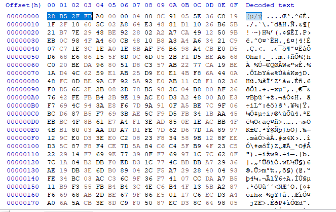
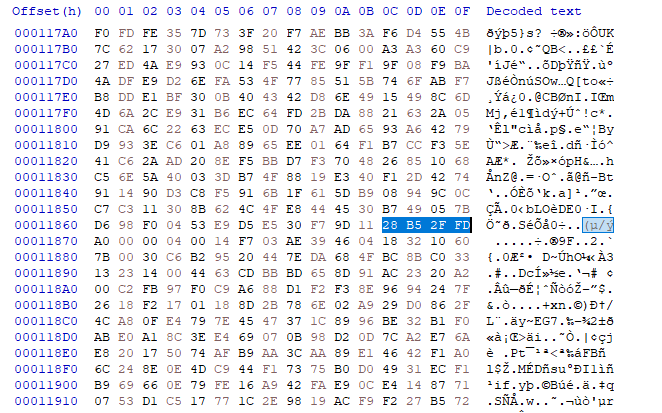
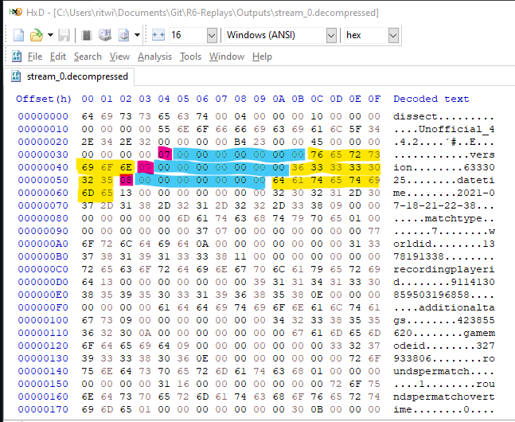
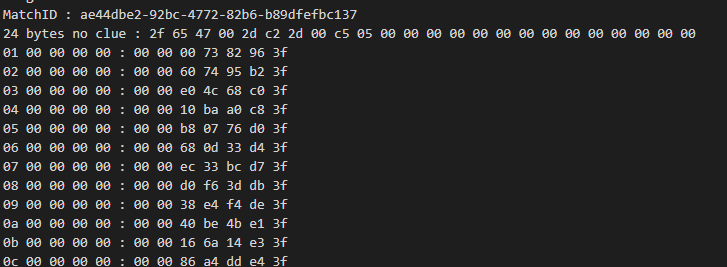
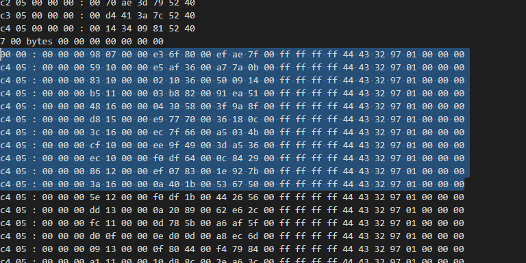
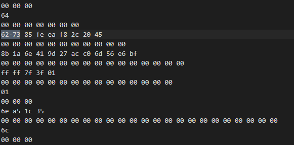
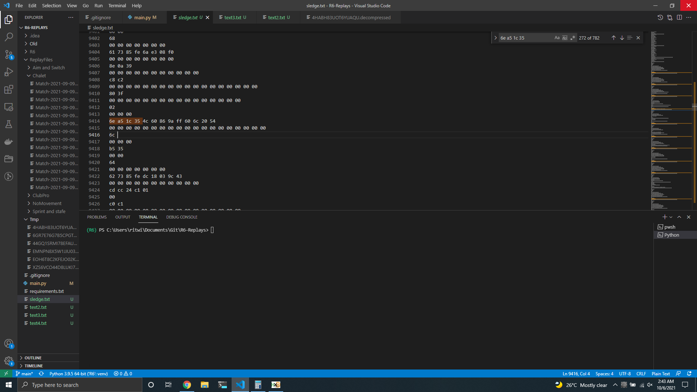
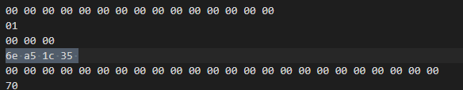

# How to use it as is
you need to install all the dependencies using:

`
pip install -r /path/to/requirements.txt
`

I suggest using a venv. After install the dependencies just run it with 

`
python main.py <replay_path>
`

this would give you all the information. By default it prints out all the things that it gets including bytes in hex that I dont understand,I generally just pipe that information into a file to read it separately using this command

`
python main.py <replay_path> > output.txt
`

If you want only the infomration that the script understands there is a boolean "Verbose" changing that to a False would make it so it only prints the metadata it understands. There is more information about the operators that can be obtained, if you want to make a script to extract for stats or something in the function "get_player".

currently you can use the script to get some basic information about the match using the script. matchid, datetime, Map*, round numbers, teamnames and the teamoperators and who was using them.
*: you can get the map but the map is based on the worldid and i havent mapped all the maps to their worldid's theres a dict on the top of the script of all of the maps that i have mapped.

## Understanding the file.
In the replay system each .rec file contains the information to play one round. the data is compressed with zstd But there seems to be something attached along the end of the file  (i got a hunch it might be the scoreboard after the round ends but i dont know)

you can see the magic for the zstd files in the hex and the assembly of the game binary also has a few zstd functions exported i think.
you can decompress the entire thing with any of the zstd libs

 

### After Decompression
The first few bytes spell out "dissect" and then a version number i have a feeling this might be their magic for a serialization/deserialization lib or a parser. there are a few temp files in the main directory of the game with the same name iirc. 
The first frame of zstd also holds the meta data of the match. there are also 2 bytes stored here which seem to be important later (i called these "special bytes" in the code).
 

after the version number the system seems to store the length (pink),then 7 0x00 bytes then then the string (cyan), we can get quite a bit of information about the match here (yellow), date-time, operators, teamnames, maps etc... there seems to be some "gmsettings" which correspond to some game mode settings but i havent figure out how they work yet. after the match id is stored starts the part where i have no clue what anyof the bytes mean. there just seems to be a pattern that i can see but i have no clue what it means. hopefully someone smarter can figure it out.

### the unknown stuff
after the metadata in the strings there seems to be a 2 byte number that keeps incrementing then 3 0x00 bytes and then 7 bytes of some information, it seems like a table of somesorts but im grasping for straws here. for example:

 

then when the incrementing bytes reach as specific number, the ones i called "special bytes" it starts a 29 byte sequence that also seems to have somesort of pattern. What that looks like when the "special" bytes are 0x3c 0x10:
 

after that ends there is what i feel individual packets of data telling us about the movement of the entities in the game but i couldn't figure out how they're structured. they always seem to start with some "id" byte that tells us about what the "packet" is and then 3 bytes that specify the entity but again i have no clue how it all works.

 

For example here the "62 73 85 fe" is repeated multiple times and the "2c 20 45" seems to be a id for an entity. sometimes preamble becomes "60 73 85 fe" but it repeats a lot. other things the repeat are also    
